# Baseline vs. MVP Workflow Comparison

This document provides a comparative breakdown between the conventional manual crop disease reporting workflow and the digital ML triage MVP.

> [!NOTE]
> **PROTOTYPE ASSUMPTION NOTICE**: Conventional baseline timelines (48–120 hours) represent manual-process assumptions for prototype comparison. They do not represent measured historical metrics from a specific commercial food-processing unit.

---

## 1. Workflow Step-by-Step Comparison

```mermaid
graph TD
    subgraph Conventional Manual Baseline Workflow
        B1["🌾 1. Symptom Noticed by Farmer"] --> B2["🗣️ 2. Informal Verbal / Phone Reporting"]
        B2 --> B3["📷 3. Inconsistent / Blurry Photo (Unvalidated)"]
        B3 --> B4["📝 4. Manual Paper Log / Delayed Follow-up"]
        B4 --> B5["⌛ 5. Expert Field Visit (48–120 Hours Later)"]
    end

    subgraph Digital ML Triage MVP Workflow
        M1["🌾 1. Symptom Noticed by Farmer"] --> M2["📱 2. Structured Observation Form (Crop, Stage, Region)"]
        M2 --> M3["🔍 3. Automated Image Quality Verification (Blur/Lighting Check)"]
        M3 --> M4["🧠 4. ML Screening & Confidence Scoring (<70% or >70%)"]
        M4 --> M5["⚠️ 5. Automatic Expert Escalation (If Confidence < 70%)"]
        M6["👨‍🌾 6. Expert Dashboard Review & Validation Decision"] --> M7["⏱️ 7. Time-to-Review Measured & Logged"]
        M5 --> M6
    end
```

---

## 2. Feature & Metric Comparison Table

| Dimension / Step | Conventional Manual Baseline | Digital ML Triage MVP | Architectural Impact |
|---|---|---|---|
| **Intake Method** | Informal phone calls, SMS, paper forms | Structured web form with mandatory metadata fields | Standardized schema across all procurement zones |
| **Language Accessibility** | Single language verbal communication | Instant English and Tamil UI toggle | Reduces communication barriers for local farmers |
| **Image Quality Verification** | None; blurry/dark photos caught days later during expert review | Automated pre-triage rejection (blur variance, brightness bounds) | Rejects unusable photos immediately with retry guidance |
| **Disease Screening** | 0% automated triage; all cases wait for manual inspection | Instant ML classification + explainable visual indicators | Auto-triages high-confidence cases (>70%), freeing expert time |
| **Escalation Trigger** | Manual farmer follow-up or procurement clerk escalation | Automatic escalation engine based on ML confidence score | Ensures uncertain cases never get lost or ignored |
| **Expert Review Access** | In-person physical farm visit required for every case | Centralized Web Expert Dashboard queue | Experts review photos & metadata remotely from anywhere |
| **Time-to-Review Measurement** | Unmeasured or tracked manually on paper logs | Automatic calculation: $\text{Time} = t_{\text{review}} - t_{\text{observation}}$ | Provides real-time SLA metrics (avg, median, min, max) |
| **Primary Metric: Time to Expert Review** | 48 to 120 hours *(simulated manual assumption)* | **4m 15s** *(measured demo review time)* | **95%+ Reduction in time to expert review** |
